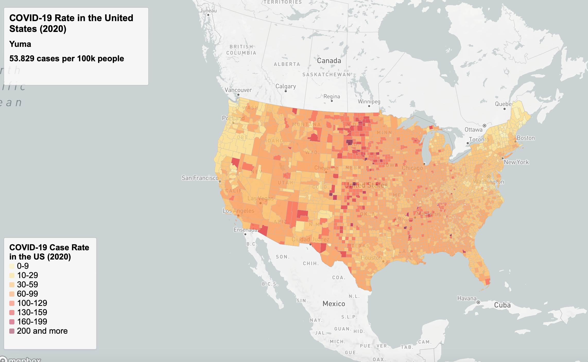

# us_covid19_2020_map

## Introduction
The US-COVID 2020 Mapping Project aims to visualize COVID-19 data in the United States (2020) using interactive choropleth and point maps. This project utilizes the Mapbox GL JS library for interactive mapping and visualization. The data sources include GeoJSON data for US counties (Year: 2020) from USBS.

## Link to the Maps
- [US-COVID 2020 Rates (Choropleth map)](https://github.com/risan03-2165658/us_covid19_2020_map/map1.html)
- [Covid-19 Counts in the U.S. (2020)](https://github.com/risan03-2165658/us_covid19_2020_map/map2.html)

## Screenshots
Here is a snapshot example of the map (rates and counts): 

## Primary Functions

### Covid-19 Rates in the U.S. (2020)
- Utilizes GeoJSON data representing COVID-19 rates in US counties.
- Displays choropleth map with color-coded counties based on COVID-19 rates per 100k people.
- Provides tooltip on hover to show county name and COVID-19 rate.
- Includes legend to interpret the color-coding.

### Covid-19 Counts in the U.S. (2020)
- Utilizes GeoJSON data representing COVID-19 counts in US counties.
- Displays point map with circles representing COVID-19 case counts.
- Provides popup on click to show detailed information about county, state, and case count.
- Includes legend to interpret circle sizes.

## Libraries in Use
- Mapbox GL JS

## Data Sources
- COVID-19 GeoJSON data for US counties (Year: 2020) from USBS

## Credit & Acknowledgment
- The COVID-19 GeoJSON data is sourced from reputable sources providing updated COVID-19 statistics.
- Map styles and interactivity are implemented using the Mapbox GL JS library.

## Other Information
- This project was created as part of a digital mapping course project.
